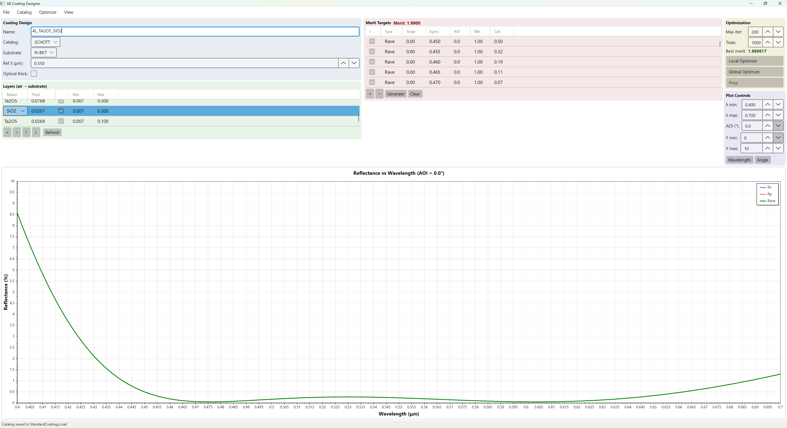

# ARCoatingDesigner

A cross-platform thin film anti-reflection (AR) coating designer with transfer matrix method (TMM) calculations, Levenberg-Marquardt optimization, and interactive spectral/angular plots.



## Features

- **Transfer matrix calculations** for multilayer thin films (s- and p-polarization)
- **Dispersion models**: Sellmeier, Cauchy, Constant, Tabulated
- **Local optimization** via damped least-squares (Levenberg-Marquardt)
- **Global optimization** via multi-trial random restart
- **Glass catalogs**: SCHOTT, HOYA, OHARA, CDGM, SUMITA (AGF format)
- **ZEMAX export** (.dat — full catalog with MATE + COAT entries)
- **Text export** (tab-delimited spectral data)
- **Interactive plots**: R vs Wavelength, R vs Angle, Index n/k plot
- **Design templates**: SLAR, V-Coat, empty design, or load from catalog

## Built-in Coating Materials

| Material | Model | Key Coefficients |
|----------|-------|-----------------|
| MgF2 | Sellmeier | n ~ 1.38 at 550 nm |
| SiO2 | Sellmeier | n ~ 1.46 at 550 nm |
| Al2O3 | Sellmeier | n ~ 1.77 at 550 nm |
| TiO2 | Cauchy | A=2.20, B=0.030, C=0.003 |
| Ta2O5 | Cauchy | A=1.97, B=0.022, C=0.002 |
| ZrO2 | Cauchy | A=1.92, B=0.022, C=0.002 |
| HfO2 | Cauchy | A=1.84, B=0.018, C=0.002 |

Custom materials can be added at runtime using Constant, Cauchy, or Sellmeier models.

## Glass Catalogs

Five AGF catalogs are included in `catalogs/Glass/`:

- **SCHOTT** - German optical glass
- **HOYA** - Japanese optical glass
- **OHARA** - Japanese optical glass
- **CDGM** - Chinese optical glass
- **SUMITA** - Japanese optical glass

Additional AGF files can be loaded through the UI.

## Prerequisites

- [.NET 8.0 SDK](https://dotnet.microsoft.com/download/dotnet/8.0)

## Build & Run

```bash
dotnet build
dotnet run --project src/ARCoatingDesigner.App
```

## Run Tests

```bash
dotnet test
```

33 unit tests covering dispersion models, thin film calculations, and optimization.

## Linux

Confirmed working on AWS CloudShell (Amazon Linux) via .NET 8.0 SDK. Avalonia provides cross-platform UI support for Windows, Linux, and macOS.

## Project Structure

```
ARCoatingDesigner/
  src/
    ARCoatingDesigner.Core/        Core calculation library (no UI dependency)
      Calculations/                  Transfer matrix method
      Catalogs/                      Glass & coating catalog I/O
      Dispersion/                    Sellmeier, Cauchy, Constant, Tabulated models
      Models/                        CoatingDesign, DesignLayer, MeritTarget, etc.
      Optimization/                  Levenberg-Marquardt optimizer
    ARCoatingDesigner.App/         Avalonia desktop application
      ViewModels/                    MVVM view models
      Views/                         Windows, dialogs, AXAML layouts
  tests/
    ARCoatingDesigner.Core.Tests/  xUnit tests
  catalogs/
    Glass/                           AGF glass catalogs
    Coatings/                        .coat coating catalog files
```

## Dependencies

| Package | Version | Purpose |
|---------|---------|---------|
| [Avalonia](https://avaloniaui.net/) | 11.2.3 | Cross-platform UI framework |
| [ScottPlot.Avalonia](https://scottplot.net/) | 5.0.55 | Interactive plotting |
| [MathNet.Numerics](https://numerics.mathdotnet.com/) | 5.0.0 | Linear algebra for LM optimizer |
| [CommunityToolkit.Mvvm](https://learn.microsoft.com/dotnet/communitytoolkit/mvvm/) | 8.4.0 | MVVM source generators |

## License

This project is licensed under the [MIT License](LICENSE).
